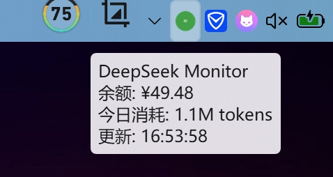
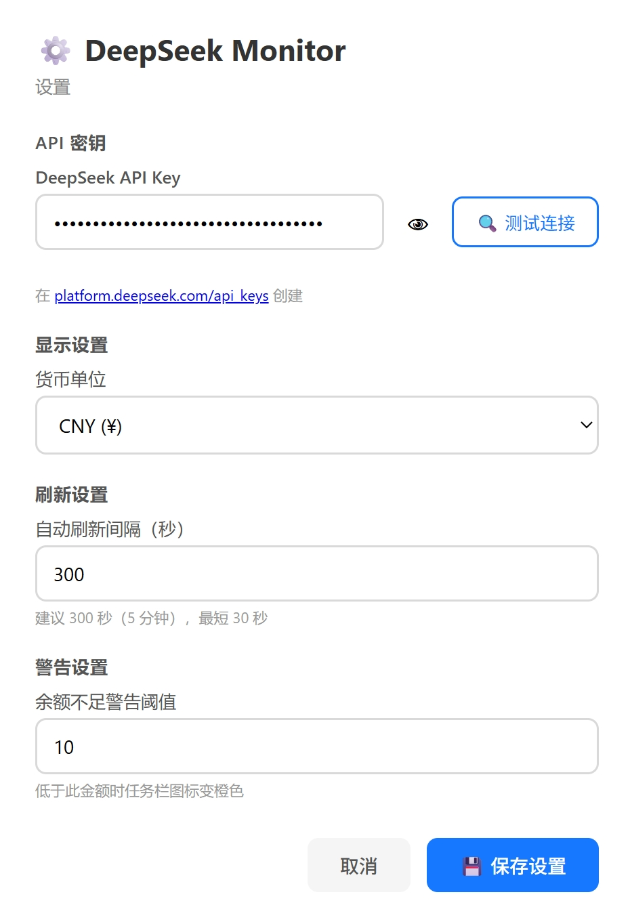

# 🔍 DeepSeek Monitor

<p align="center">
  
</p>

<p align="center">
  <b>Windows 任务栏常驻工具 — 实时监控 DeepSeek API 余额 & Token 消耗</b>
</p>

<p align="center">
  
  
  
</p>

---

## ✨ 功能

- 📊 **托盘图标实时显示余额** — 不用打开网页，一眼看到余额
- 💬 **悬浮 tooltip** — 鼠标悬停查看 余额 / 今日消耗 / 更新时间
- 🔢 **当日 Token 消耗估算** — 基于余额变化自动推算
- ⏱️ **可自定义刷新间隔** — 默认每 5 分钟自动刷新
- ⚠️ **余额不足警告** — 低于阈值图标变橙色，归零变红色
- 🔧 **图形化设置界面** — 支持测试 API 连接
- 🚀 **一键安装脚本** — 自动配置依赖 + 桌面快捷方式 + 开机自启

---

## 📸 截图

### 任务栏悬浮提示


### 设置界面


---

## 📥 下载

### 直接下载 EXE（无需 Python）

👉 **[📦 下载最新版 DeepSeekMonitor.exe](../../releases/latest)**

下载后双击运行即可，程序自动在通知区显示托盘图标。

### 从源码运行

```bash
git clone https://github.com/YOUR_USERNAME/deepseek-monitor.git
cd deepseek-monitor
pip install -r requirements.txt
python run.py
```

---

## 📋 系统要求

- **Windows 10 / 11**
- Python 3.8 或更高版本（源码运行时需要；直接使用 EXE 则不需要）
- DeepSeek API Key → [创建入口](https://platform.deepseek.com/api_keys)

---

## 🚀 安装

### 方式一：EXE 直接运行（推荐）

下载 `DeepSeekMonitor.exe`，双击启动。首次运行会自动弹出设置窗口要求填入 API Key。

### 方式二：一键安装脚本

```
双击运行 setup.bat
```

脚本会自动：
1. 检查 Python 环境
2. 安装依赖（pystray / Pillow / requests）
3. 创建桌面快捷方式
4. 询问是否开机自启

---

## 🖱️ 使用

### 托盘图标状态

| 图标 | 含义 |
|------|------|
| 🟢 绿色数字 | 余额正常，数字为余额简写（如 `1.2K` = ≈1200 元） |
| 🟠 橙色 `!` | 余额低于警告阈值（默认 < ¥10） |
| 🔴 红色 `X` | 余额为 0 或 API 连接失败 |
| ⏳ 灰色 `..` | 加载中 / 查询中 |

### 右键菜单

- 显示当前余额明细（充值余额 / 赠送余额）
- 显示当日预估 Token 消耗
- **刷新** — 手动立即查询
- **设置** — 打开设置网页
- **退出** — 关闭程序

### 设置项

| 设置 | 说明 | 默认值 |
|------|------|--------|
| API Key | DeepSeek API 密钥 | — |
| 货币单位 | CNY / USD | CNY |
| 刷新间隔 | 秒 | 300（5 分钟） |
| 警告阈值 | 低于此金额变橙色 | ¥10 |

---

## 🧮 Token 消耗估算原理

DeepSeek 暂未开放 Token usage API，所以用**余额变化**推算：

```
当日 Token 消耗 ≈ (今日首次余额 - 当前余额) ÷ 混合均价 × 1,000,000
```

- 均价按输入/输出混合约 ¥4/百万 Token 估算
- 每天 0 点自动重置
- 常规使用场景精度足够

---

## 📁 项目结构

```
deepseek-monitor/
├── run.py              # 入口
├── run.bat             # 双击启动（无控制台窗口）
├── setup.bat           # 一键安装脚本
├── install.py          # 安装逻辑
├── requirements.txt    # Python 依赖
├── .gitignore
├── LICENSE
├── README.md
├── assets/
│   ├── icon.ico
│   └── screenshots/
│       ├── tooltip.png
│       └── settings.png
└── src/
    ├── main.py         # 主程序入口
    ├── tray.py         # 系统托盘管理
    ├── api.py          # DeepSeek API 交互
    ├── config.py       # 配置 & 历史记录
    └── settings.py     # Web 设置界面
```

---

## 🙋 FAQ

**托盘图标不在任务栏显示？**  
点击任务栏 `^` 箭头展开隐藏图标区，把 DeepSeek Monitor 拖到任务栏即可。

**API Key 在哪里？**  
登录 [DeepSeek Platform](https://platform.deepseek.com/api_keys) → 创建 API Key。

**Token 消耗不准确？**  
基于余额变化推算，多设备共用同一 Key 或充值/退款会影响精度。

**怎么卸载？**  
删除程序文件夹即可。开机自启的话，再删掉 `shell:startup` 里的快捷方式。

**运行日志在哪？**  
`%APPDATA%/DeepSeekMonitor/logs/monitor.log`

---

## 📝 License

MIT — 随意使用、修改、分发。
